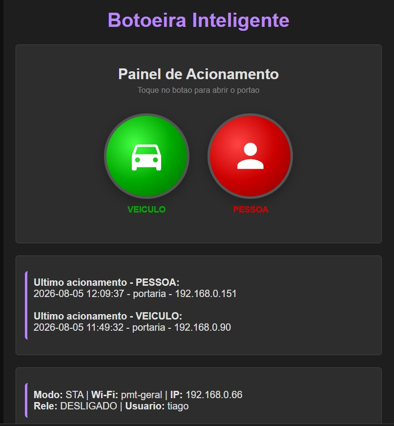

# 🏠 Botoeira Inteligente

Sistema de controle de portão via **ESP8266 (ESP-01)** com interface web responsiva. Pelo celular, quem está autorizado aciona o portão para **pessoas** ou **veículos** com um toque, tudo com **login, registro de acionamentos e tema claro/escuro**.

[-E7352C?logo=espressif)](https://www.espressif.com/)

---

## 🚀 Funcionalidades

- 🔐 **Login com sessão** — autenticação por cookie (`sid`) e perfis de acesso (**Admin** e **Usuário**)
- 🚪 **Dois botões de acionamento** — **PESSOA** (vermelho) e **VEICULO** (verde), enviam um pulso de **1 segundo** ao relé (contato seco no contato NO)
- 📝 **Log de acionamentos** — data/hora (sincronizada via **NTP**, fuso de São Paulo UTC-3), IP do dispositivo, usuário e tipo de acionamento
- 👤 **Últimos acionamentos** — a tela inicial mostra quem acionou por último, separado por PESSOA e VEICULO
- 🌙 **Modo claro / escuro** — alterna com um toque e fica salvo na memória
- 📶 **Wi-Fi inteligente** — conecta na rede configurada; se não conseguir, cria um **Access Point próprio** (`botoeira`) automaticamente
- ⚙️ **Configurações** — Wi-Fi (com escaneamento de redes), porta do servidor HTTP e comportamento dos botões
- 🧑‍💼 **Gerenciamento de usuários** (somente Admin) — cadastrar, habilitar/desabilitar, alterar senha e conceder perfil Admin (**usuários não podem ser excluídos**)
- 📊 **Status JSON** — endpoint para monitoramento e integração externa

---

## 🔌 Hardware

| Componente | Detalhe |
|---|---|
| Módulo | ESP-01 / ESP-01S (ESP8266) |
| Placa relé | ESP-01 Relay v1.0 — 1 canal 5V, relé Songle SRD-05VDC-SL-C (10A) |
| Acionamento | GPIO0 do ESP-01 controla o relé (contato seco no **NO**) |
| Alimentação | 5V no borne da placa relé (regulador interno AMS1117 → 3,3V) |

> ⚠️ **Modificações de hardware aplicadas** (placa v1.0): jumper **CH_PD → VCC** (habilita o boot) e **remoção do resistor R2** do GPIO0 (evita entrar em modo flash). Limitação conhecida documentada no código: ao religar a energia, o relé pode dar um pulso no boot. Decisão do projeto registrada: migrar para o **ESP-01S Relay Module V4.0** (driver active-LOW), que não apresenta esse comportamento.

---

## 🛠️ Stack

| Camada | Tecnologia |
|---|---|
| Firmware | Arduino C++ para ESP8266 (core 3.1.2) |
| Web Server | ESP8266WebServer |
| Persistência | SPIFFS (usuários, log) + EEPROM (Wi-Fi, tema, porta) |
| JSON | ArduinoJson |
| Relógio | NTPClient + time.h (UTC-3) |
| Interface | HTML + CSS + JS (mobile first) |

---

## 💻 Como instalar e gravar

### 1️⃣ Pré-requisitos
- Arduino IDE 1.8.19+
- ESP8266 core 3.1.2 instalado (Gerenciador de placas)
- Placa selecionada: **Generic ESP8266 Module** (Flash 1MB, SPIFFS 512KB)

### 2️⃣ Configuração inicial
1. Grave o sketch pela primeira vez com o ESP-01 em modo flash (GPIO0 no GND durante o reset).
2. Ligue o módulo: ele tenta conectar na rede salva; se não houver, cria o AP **`botoeira`** (senha `85245678`).
3. Acesse `http://192.168.4.1`, faça login e entre em **Configurar Wi-Fi** para salvar sua rede.
4. Depois de reiniciar, acesse pelo IP da rede (`http://<IP>`).

---

## 👥 Usuários padrão

| Usuário | Senha | Perfil |
|---|---|---|
| `financeiro` | `dqgh3ffrdg` | Admin |
| `adm` | `Tenta&70` | Admin |
| `natalia` | `nath@2026` | Usuário |
| `portaria` | `d87hbkx7x9` | Usuário |

> 🔒 **Altere as senhas padrão** pela tela **Usuarios** (somente Admin) antes de colocar em produção. Em instalações novas, os padrões são criados automaticamente no primeiro boot (arquivo `users.txt` no SPIFFS).

---

## 📡 Rotas

| Rota | Descrição |
|---|---|
| `/` | Tela principal (painel de acionamento + últimos acionamentos) |
| `/login` | Login |
| `/logout` | Encerra a sessão |
| `/acionar?tipo=pessoa` / `veiculo` | Aciona o relé (pulso de 1s) |
| `/config` | Configurar Wi-Fi (STA/AP) |
| `/configGeral` | Porta do servidor e comportamento dos botões |
| `/users` | Gerenciar usuários (somente Admin) |
| `/log` | Registro de acionamentos |
| `/status` | Status em JSON |
| `/toggleModo` | Alterna tema claro/escuro |

---

## 📜 Licença

MIT — © 2026 Tiago de Abreu

---

## 🧑‍💻 Autor

Desenvolvido por **Tiago de Abreu** — Full-Stack Developer em Santa Bárbara d'Oeste, SP.

